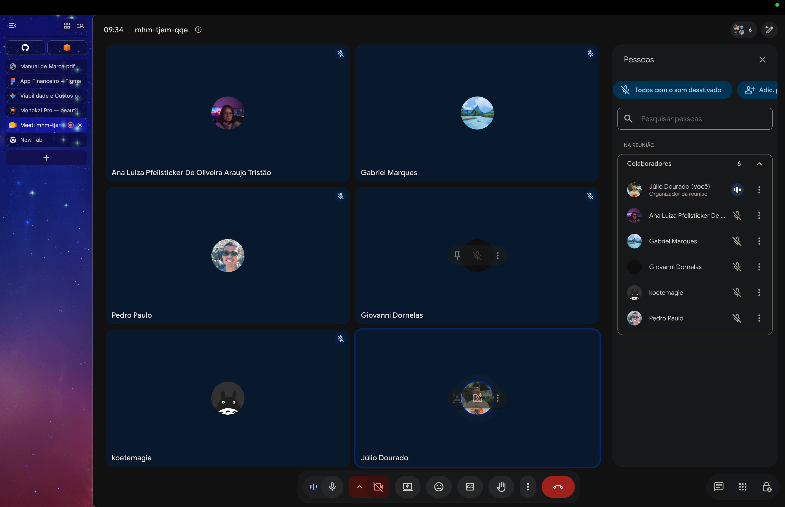

# Ata de Reunião — Alinhamento Sprint 1

**Data:** 08/09/2026
**Horário:** 09:34
**Plataforma:** Google Meet

## Pauta

Alinhamento do andamento das tarefas de cada área/grupo na Sprint 1
(01/09 a 07/09), conforme os itens já em acompanhamento nas issues do
GitHub de cada grupo.

## Evidência da reunião

## Entregas da Sprint

Atividades já concluídas por trio/dupla até o momento da reunião
(08/09/2026), uma por linha, com a evidência correspondente. Cada grupo
deve preencher sua própria seção seguindo o padrão da tabela abaixo.

### Grupo 1 — Infraestrutura, hospedagem e DevOps

Detalhamento completo na [issue #5](https://github.com/AppFinanceiro-GECS/doc-biveto-fin/issues/5).

| Nome do Trio/Dupla | Atividade | Evidência |
| --- | --- | --- |
| Julio Dourado e Brenno da Silva Oliveira | Elaborou a viabilidade técnica do iOS (custos, ambiente de build, App Review, TestFlight) | [viabilidade-tecnica-ios.md](entregaveis/viabilidade-tecnica-ios.md) |
| Julio Dourado e Brenno da Silva Oliveira | Registrou a ata da reunião de alinhamento da Sprint 1 | [reuniao-alinhamento-sprint1.png](../assets/reuniao-alinhamento-sprint1.png) |

### Grupo 2 — [completar com o nome da frente]

Detalhamento completo na [issue #4](https://github.com/AppFinanceiro-GECS/doc-biveto-fin/issues/4).

| Nome do Trio/Dupla | Atividade | Evidência |
| --- | --- | --- |
| [nome do integrante ou da dupla] | [atividade concluída] | [link para o documento, PR, print ou comentário que comprova a entrega] |
| [nome do integrante ou da dupla] | [atividade concluída] | [link para o documento, PR, print ou comentário que comprova a entrega] |

> Preencher com as entregas reais do Grupo 2 e remover esta nota.

### Grupo 5 — FrontEnd UI/UX

Detalhamento completo na [issue #4](https://github.com/AppFinanceiro-GECS/doc-biveto-fin/issues/3).

| Nome do Trio/Dupla | Atividade | Evidência |
| --- | --- | --- |
| Ana Luiza Pfeilsticker, Gabriel | Construção do manual de marca | https://www.figma.com/design/jWIl7Xa4jKs7m5UmEb6oOe/App-Financeiro?node-id=0-1&t=6beOrK98jMZBvZxw-1 |
| João | Mapeamento das telas e fluxos atuais | https://www.figma.com/design/jWIl7Xa4jKs7m5UmEb6oOe/App-Financeiro?node-id=0-1&t=6beOrK98jMZBvZxw-1 |

## Registro

Reunião realizada para verificação do andamento das entregas de cada
grupo na Sprint 1. O status detalhado de cada atividade está refletido na
tabela acima e permanece atualizado nas respectivas issues no GitHub.
